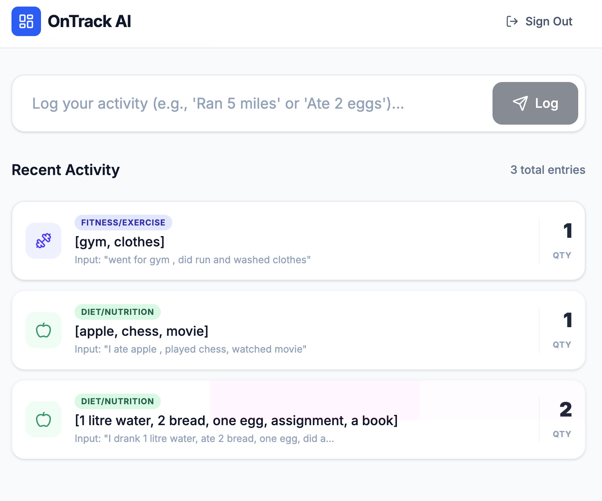
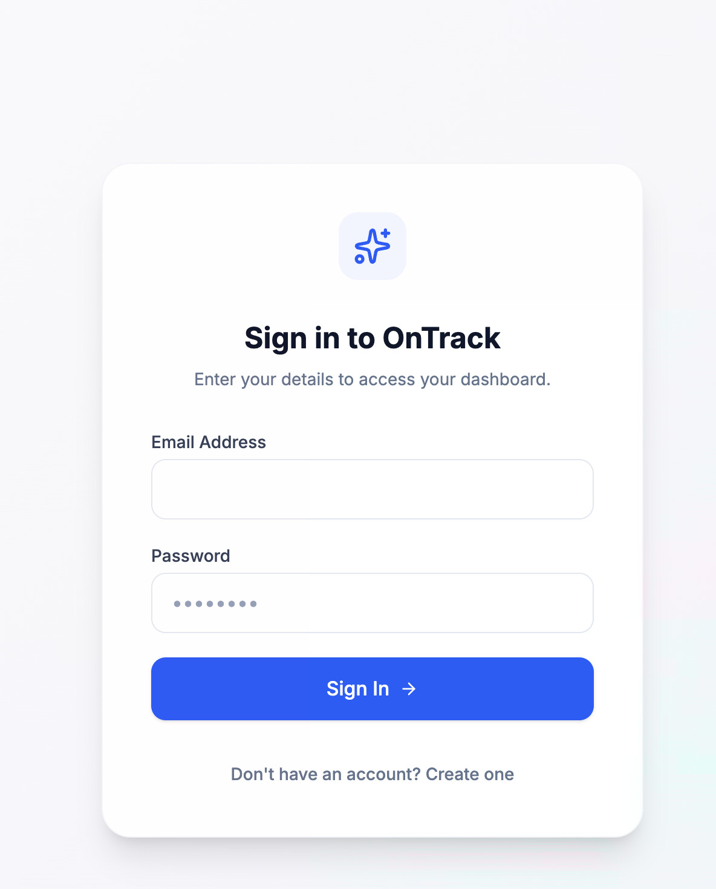

# 🧠 OnTrack AI: NLP-Powered Habit Tracker

[](https://github.com/qubeena07/Habit-tracker-using-NLP-and-fastapi/actions)
[](https://qubeena07.github.io/Habit-tracker-using-NLP-and-fastapi)
[](https://www.python.org/downloads/release/python-3110/)

OnTrack AI is a full-stack web application that allows users to log their daily habits and activities using natural conversational language. Instead of clicking through tedious dropdown menus, users can simply type *"I ran 5 miles and ate 3 eggs,"* and the custom Natural Language Processing (NLP) engine will automatically parse, categorize, and quantify the data into a structured database schema.

### 🌐 Live Demo
* **Frontend UI:** [https://qubeena07.github.io/Habit-tracker-using-NLP-and-fastapi](https://qubeena07.github.io/Habit-tracker-using-NLP-and-fastapi)
* **Backend API:** Hosted via Render

---

## 📸 Application Previews

<div align="center">
  
  
  <p float="left">
    
     
  </p>
</div>

---

## ✨ Key Architectural Features

* **Custom Machine Learning Pipeline:** Utilizes a local `spaCy` NLP model to process user inputs securely and rapidly without relying on costly third-party LLM APIs.
* **Decoupled Architecture:** A strict separation of concerns utilizing a React-based Next.js frontend and a high-concurrency Python backend.
* **Robust Security:** Implements custom OAuth2.0 flows, stateless JWT session management, and `bcrypt` password hashing.
* **Automated DevOps:** Fully automated Continuous Integration and Continuous Deployment (CI/CD) pipelines built with GitHub Actions to isolate Node.js builds and PyTest environments.

---

## 🛠️ Tech Stack

**Frontend (Client)**
* **Framework:** Next.js (React) / TypeScript
* **Styling:** Tailwind CSS
* **UI/UX:** Lucide Icons, Sonner (Toast Notifications)

**Backend (API & AI)**
* **Framework:** FastAPI (Python)
* **NLP Engine:** spaCy (`en_core_web_sm`)
* **Database:** SQLite & SQLAlchemy (ORM)
* **Auth:** PyJWT, Passlib

**DevOps & Infrastructure**
* **CI/CD:** GitHub Actions
* **Hosting:** GitHub Pages (Frontend) / Render (Backend)

---

## 🚀 Local Installation & Setup

If you wish to run this application locally on your machine, follow these steps:

### 1. Clone the Repository
```bash
git clone [https://github.com/qubeena07/Habit-tracker-using-NLP-and-fastapi.git](https://github.com/qubeena07/Habit-tracker-using-NLP-and-fastapi.git)
cd Habit-tracker-using-NLP-and-fastapi